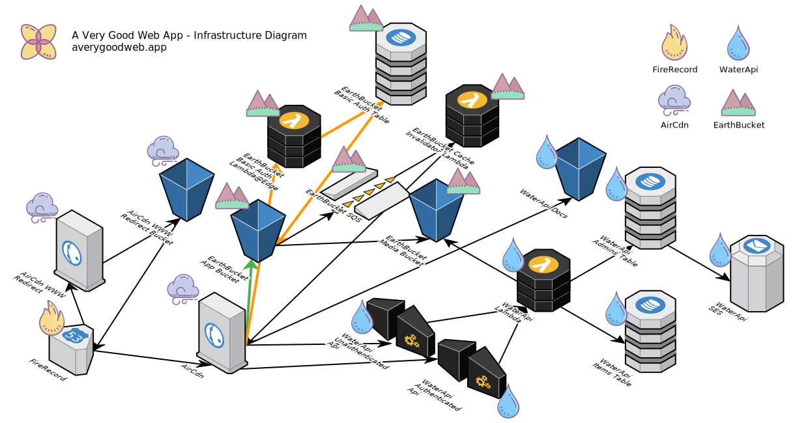

# A Very Good Web App - Infrastructure

Prerequisites
- [An AWS Account with programmatic permission](https://aws.amazon.com/)
- [aws cli](https://docs.aws.amazon.com/cli/latest/userguide/cli-chap-welcome.html)

## Project Description

The Infrastructure for A Very Good Web App declares an AWS cloud evironment "stack" that hosts your web app (or website).

## Cloud Diagram

Here is a diagram of what the infrastructure looks like:



More info can be found at https://averygoodweb.app.

## AWS CloudFormation Stack Info

These stacks are provisioned using [AWS CloudFormation](https://aws.amazon.com/cloudformation/).

The CloudFormation templates are located in the [cloudformation](cloudformation/) directory.

The templates have codenames which represent the "elements" of the infrastructure. The names are:

| stack       | template                                                             | description                                                                                                 |
|-------------|----------------------------------------------------------------------|-------------------------------------------------------------------------------------------------------------|
| Global      | [cloudformation/global.yaml](./cloudformation/global.yaml)           | The *Global* Stack that creates the web app's Domain Name to Hosted Zone Id and TLS Certificate connection. |
| Environment | [cloudformation/environment.yaml](./cloudformation/environment.yaml) | The *Parent* Stack that handles all updates between child stacks.                                           |
| FireRecord  | [cloudformation/firerecord.yaml](./cloudformation/firerecord.yaml)   | The *Child* Stack that maps the Hosted Zone Id and A Records to the CDN.                                    |
| AirCdn      | [cloudformation/aircdn.yaml](./cloudformation/aircdn.yaml)           | The *Child* Stack that contains the application CDN.                                                        |
| EarthBucket | [cloudformation/earthbucket.yaml](./cloudformation/earthbucket.yaml) | The *Child* Stack that holds the front-end ui.                                                              |
| WaterApi    | [cloudformation/waterapi.yaml](./cloudformation/waterapi.yaml)       | The *Child* Stack that holds the backend api.                                                               |


## Installation Instructions

1. Fork this repo, the [EarthBucket](https://github.com/averygoodidea/averygoodwebapp-earthbucket) repo, and the [WaterApi](https://github.com/averygoodidea/averygoodwebapp-waterapi) repo.
2. On gatsbyjs.com, connect your forked earthbucket repo master branch to gatsby cloud.
3. Clone your forked version of this repo, ie:
`git clone git@github.com:<mygithubusername>/averygoodwebapp-infrastructure.git`
4. Inside the repo, make a copy of the .env.example file

```
cd ./averygoodwebapp-infrastructure
cp .env.example .env
```

5. Open the .env file in your editor of choice, and update its variables file with the appropriate values

| variable           | value                | description                                                                                                                                                                                                                                               |
|--------------------|----------------------|-----------------------------------------------------------------------------------------------------------------------------------------------------------------------------------------------------------------------------------------------------------|
| AWS_WATERAPI_EMAIL | `<awsWaterApiEmail>` | an admin email for your project                                                                                                                                                                                                                           |
| DOMAIN_NAME        | `<domainName>`       | this project's domain name                                                                                                                                                                                                                                |
| CACHE_HASH         | `<cacheHash>`        | a work-around to enable a stack to be deployed while a previous Lambda@Edge function deletes. Generate string from random.org, and only update it if CloudFormation throws an error that it cannot delete EarthBucketBasicAuthLambdaEdge.                 |
| GATSBY_WEBHOOK_ID  | `<gatsbyWebhookId>`  | the string that connects the infrastructure to Gatsby Cloud. You can copy and paste this value from gatsbyjs.com/dashboard/ > View Details > Site Settings > Webhook. Under "Preview Webhook", copy and paste only the hash string at the end of the url. |

6. Initialize your Global Stack
`sh ./scripts/init.sh <awsProfile>`
7. Follow the Prompts that appear in the terminal window:

```
------------------
Step 1 of 2 (AWS Route 53)
Copy the DNS Addresses from the ${DOMAIN_NAME} Hosted Zone here:
https://console.aws.amazon.com/route53/home?region=us-east-1
into your domain registrar's DNS records.
------------------
Step 2 of 2 (AWS Certificate Manager)
Click '$DOMAIN_NAME' > 'Create Record in Route 53' for each pending validation here:
https://console.aws.amazon.com/acm/home?region=us-east-1#/
------------------
```

8. Deploy your Production Environment Stack
`sh ./deploy.sh prod <awsProfile>`
9. In the parent directory of averygoodwebapp-infrastructure, clone your forked version of the WaterApi repo, ie:

```
cd ../
git clone git@github.com:<mygithubusername>/averygoodwebapp-waterapi.git
```

10. Install the node packages inside of the WaterApi repo.

```
cd ./averygoodwebapp-waterapi
npm install

```

11. Make a copy of the .env.production.example file

```
cd ./averygoodwebapp-waterapi
cp .env.production.example .env.production
```

12. Open the .env.production file in your editor of choice, and update its variables file with the appropriate values

| variable           | value                                        | description                                                                                                                                                                                                                     |
|--------------------|----------------------------------------------|---------------------------------------------------------------------------------------------------------------------------------------------------------------------------------------------------------------------------------|
| AWS_WATERAPI_EMAIL | `<awsWaterApiEmail>`                         | an admin email for your project                                                                                                                                                                                                 |
| DOMAIN_NAME        | `<domainName>`                               | this project's domain name                                                                                                                                                                                                      |
| AWS_WATERAPI_KEY   | `<domainNamespaceEnvironmentAwsWaterApiKey>` | the water api key which you can copy and paste from: https://console.aws.amazon.com/cloudformation/home `<domainNamespace>`-`<environment>`-stack > Outputs. Copy the "apikey" generated from the url located at awsWaterApiKey |

13. Initialize the WaterApi codebase

`sh ./scripts/init.sh prod <awsProfile>`

14. In the parent directory of averygoodwebapp-infrastructure, clone your forked version of the EarthBucket repo, ie:

```
cd ../
git clone git@github.com:<mygithubusername>/averygoodwebapp-earthbucket.git
```

15. Install the node packages inside of the EarthBucket repo.

```
cd ./averygoodwebapp-earthbucket
npm install
```

16. Make a copy of the .env.production.example file

```
cd ./averygoodwebapp-earthbucket
cp .env.production.example .env.production
```

17. Open the .env.production file in your editor of choice, and update its variables file with the appropriate values

| variable                     | value                                                 | description                                                                                                                                                                                                                     |
|------------------------------|-------------------------------------------------------|---------------------------------------------------------------------------------------------------------------------------------------------------------------------------------------------------------------------------------|
| AWS_ACCESS_KEY_ID            | `<awsAccessKeyId>`                                    | this value can be found by running the following command `sudo nano ~/.aws/credentials`. You can find it under the aws profile you have been using for this installation guide.                                                 |
| AWS_SECRET_ACCESS_KEY        | `<awsSecretAccessKey>`                                | this value can be found by running the following command `sudo nano ~/.aws/credentials`. You can find it under the aws profile you have been using for this installation guide.                                                 |
| AWS_REGION                   | `<awsRegion>`                                         | This value can be found at https://console.aws.amazon.com/console/home in the upper-right hand corner, immediately to the right of your profile name. If in doubt, use us-east-1.                                               |
| AWS_EARTHBUCKET_APP_BUCKET   | `<domainNamespace>`-`<environment>`-earthbucket-app   | you can copy and paste the EarthBucket app bucket value from: https://console.aws.amazon.com/cloudformation/home `<domainNamespace>`-`<environment>`-stack > Outputs. Get the value from Key awsEarthBucketAppBucket            |
| AWS_EARTHBUCKET_MEDIA_BUCKET | `<domainNamespace>`-`<environment>`-earthbucket-media | you can copy and paste the EarthBucket media bucket value from: https://console.aws.amazon.com/cloudformation/home `<domainNamespace>`-`<environment>`-stack > Outputs. Get the value from Key awsEarthBucketMediaBucket        |
| GATSBY_EARTHBUCKET_HOSTNAME  | [`<environment>`.]`<domainName>`                      | the fully qualified domain name. If this is the production environment, use the project domain name, ie: averygoodweb.app. IF a lower environment, include the sub-domain, ie: dev.averygoodweb.app.                            |
| GATSBY_TINYLETTER_USERNAME   | `<tinyLetterUsername>`                                | your username created at tinyletter.com. This enables your web app to collect user emails out of the box.                                                                                                                       |
| GATSBY_WATERAPI_KEY          | `<domainNamespaceEnvironmentAwsWaterApiKey>`          | the water api key which you can copy and paste from: https://console.aws.amazon.com/cloudformation/home `<domainNamespace>`-`<environment>`-stack > Outputs. Copy the "apikey" generated from the url located at awsWaterApiKey |
| VALINE_LEANCLOUD_APP_ID      | `<valineLeanCloudAppId>`                              | this value can be copied and pasted from https://console.leancloud.app/applist.html#/apps > `<appTitle>` > Settings > App keys. Copy the value from AppID.                                                                      |
| VALINE_LEANCLOUD_APP_KEY     | `<valineLeanCloudAppKey>`                             | this value can be copied and pasted from https://console.leancloud.app/applist.html#/apps > `<appTitle>` > Settings > App keys. Copy the value from AppKey.                                                                     |

18. Update Gatsby Cloud Environment Variables with the above .env data.

Go to https://www.gatsbyjs.com/dashboard > View details > Site Settings > General > Environment Variables.

Under "Preview environment variables", click Edit > Bulk Add Variables.
Copy and paste the completed .env.production content into the textarea.
Click, Add.

Under "Builds environment variables", click Edit > Bulk Add Variables.
Copy and paste the completed .env.production content into the textarea.
Click, Add.

19. Connect Gatsby Cloud to AWS S3.

Go to https://www.gatsbyjs.com/dashboard > View details > Site Settings > Integrations > Hosting.

Under AWS, click Connect.

Add in the following values:

| name              | value                                               |
|-------------------|-----------------------------------------------------|
| Access Key ID     | `<awsAccessKeyId>`                                  |
| Secret Access Key | `<awsSecretAccessKey>`                              |
| Bucket            | `<domainNamespace>`-`<environment>`-earthbucket-app |

20. Initialize the EarthBucket codebase with the prod environment

```
sh ./scripts/init.sh prod <awsProfile>
```

21. Deploy the initial build to your domain.

Go to https://www.gatsbyjs.com/dashboard > Deploys

Click Trigger build.

22. Once the build has completed running, confirm your deployment has been successful by visiting your domain name.

The installation is complete! Feel free to modify to create your own web app or website!

> If you have any issues following this guide just send me an email at avery-at-averygoodidea-dot-com and I'll help you troubleshoot any issues.

## Continuous Deployment

Please note, a minimum of two environments have to be deployed, in the following order:

1. `<domainNamespace>-global-stack`
2. `<domainNamespace>-prod-stack`
3. `<domainNamespace>-<environmentA>-stack`[Optional]
4. `<domainNamespace>-<environmentB>-stack`[Optional]
etc...

**All non-production environments are secured with a Basic Authenticaion Request Header.**

In order to create an username and password combination, follow these steps:

1. Navigate to (https://console.aws.amazon.com/dynamodb/home?region=us-east-1#tables:)[https://console.aws.amazon.com/dynamodb/home?region=us-east-1#tables:]
2. Click '`<environmment>-EarthBucketBasicAuthTable`' > 'Items'
3. Click, 'Create Item', then add the following values, replacing `<authUser>` and `<authPass>` with their corresponding base64 values.

| name         | value        | description                                                                                                                                                                                                                                                                                                           |
|--------------|--------------|-----------------------------------------------------------------------------------------------------------------------------------------------------------------------------------------------------------------------------------------------------------------------------------------------------------------------|
| partitionKey | published    | a required string for each record in this table                                                                                                                                                                                                                                                                       |
| authUser     | `<authUser>` | Enter a username value. Be sure to then store this string in a safe place, like lastpass.com. |
| authPass     | `<authPass>` | Generate an authPass string value from [Random.org](https://www.random.org/strings/?num=1&len=20&digits=on&upperalpha=on&loweralpha=on&unique=on&format=html&rnd=new) Then Base64 this string at https://www.base64encode.net/. Be sure to then store this string in a safe place, like [lastpass.com](lastpass.com). |

In order to add the `<authPass>`, you should:
4. Click the plus button to the left of "authUser".
5. In the drop-down box, Click 'Append' > 'String'
6. In the "field" input, "authPass"
7. In the "value" input, enter your random password string.
8. Click, 'Save'.
9. Now, navigate to `<environment>`.`<domainName>` and enter the `<authUser>` and `<authPass>`. You should now be able to sign into the lower environment.

To add, update and/or delete auth users at a later date, just edit the '`<environment>-EarthBucketBasicAuthTable`', accordingly.

### Warning

Sometimes redeploying a child stack is prevented due to a Lambda@Edge reserved name from a previous deployment.

To enable new deployments to occur

1. update the .env.`<environment>` environment variable `CACHE_HASH` with a [random string](https://www.random.org/strings/?num=1&len=6&digits=on&upperalpha=on&loweralpha=on&unique=on&format=html&rnd=new).
```
...
# work-around to enable a stack to be deployed while a previous Lambda@Edge function deletes.
# update with a newly random string when a Lambda@Edge function stops a new deployment from occuring.
# string generated from random.org.
CACHE_HASH=<cacheHash>
...
```

2. re-run the deployment script, ie:

`sh ./scripts/deploy.sh <environment> <awsProfile>`

Please keep in mind you should go into the AWS Lambda console and delete any Lambda@Edge functions that are not in use. You'll have to give AWS some time to free the function up to the point of being able to deleted. **Sometimes it can take days!**

More info about Lambda@Edge replicas and caching can be found at this link:
https://stackoverflow.com/questions/45296923/cannot-delete-aws-lambdaedge-replicas

### About the EarthBucketCacheInvalidator Lambda

The purpose of this lambda is to enable the EarthBucketS3Bucket to clear it's own cache. This is critical it receives s3 file syncs from Gatsby Cloud, and without this Lambda CloudFront would not know to clear its cache, thus preventing site updates to show.

The Lambda receives notifications from S3 via SQS.

The AWS Documentation says that SQS can detected when it's empty by analyzing the attributes:

```
ApproximateNumberOfMessagesVisible
ApproximateNumberOfMessagesNotVisible
ApproximateNumberOfMessagesDelayed
```

If they evaluate to less than or equal to 1, then that means that the queue is empty or close to empty.

- https://docs.aws.amazon.com/AWSSimpleQueueService/latest/SQSDeveloperGuide/sqs-short-and-long-polling.html#sqs-long-polling

but after further analysis and development, it appears that the SQS object doesn't have the property, `ApproximateNumberOfMessagesNotVisible`. It only has `ApproximateNumberOfMessages`.

Therefore, we will just use the `ApproximateNumberOfMessages` value instead.

Next, because of the polling mechanism behind SQS, it inconsistenly reports the above attributes as less than or equal to 1. Polling is not an accurate way to assess what's left in the queue. It's only a guess unless the poll request happens to perfectly land on the last queue or so.

So the Lambda kicks off an invalidation at the start of every log group.

The idea here is the latency between the S3 Put Object event, the SQS delay, and time CloudFront takes to invalidate will be enough time to catch clear files on S3, even though the queue messages have not actually completed yet.

Just in case, if this is on the last or so queue message in the log group, kick off an invalidation.

Ultimately, this Lambda  kicks off multiple CloudFront invalidations since multiple requests can pass this use-case.

In theory, it's better to kick off a few more invalidations than none at all. The limit of concurrent invalidations is 3000. Running 5-10 invalidations is a tolerable to perform CloudFront invalidations of S3.