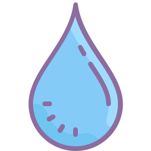

# A Very Good Web App - WaterApi Documentation



Prerequisites
- [An AWS Account with programmatic permission](https://aws.amazon.com/)
- [aws cli](https://docs.aws.amazon.com/cli/latest/userguide/cli-chap-welcome.html)

The API is documented with Swagger, a documentation tool to help describe the api.

The docs are published at:

https://averygoodweb.app/api/1/docs/

## Editing

To edit the api documentation, run the following commands:

```
# install swagger
npm install -g swagger

# edit the file swagger template file
swagger_swagger_fileName='api-docs/swagger/swagger.template.yaml' swagger project edit
```

When you are done editing the file, run:

`sh ./scripts/render.sh <environment>`

This builds the `./docs/swagger/swagger.yaml` file with the environment specified to it in the `host` value, and then builds the `./build/` files.


To publish the api docs, run:

`sh ./publish.sh <environment> <awsProfile>`

All files in `./build/*` gets deployed to the ThalliumEliApiDocsS3Bucket resource to then be referenced by BariumNahumCdn, at:

"https://[environment]melalogic.com/api/1/docs/"

## Style the API Documentation

The documentation is stylized with [ReDoc](https://github.com/Rebilly/ReDoc). ReDoc allows for swagger documentation to be presented as a one-page html document. To customize the header, footer and css of the documentation, edit the follwing file:

`./redoc/redoc.template.hbs`.

To view the documentation locally, run the following commands:

```
# install redoc-cli
npm install -g redoc-cli

# view edits
redoc-cli serve ./swagger/swagger.yaml -t ./redoc/redoc.hbs --options.hideLoading --options.hideDownloadButton --options.expandResponses="all"
```

Just like when the editing is done, when you are done stylizing the documentation, run:

`sh ./publish.sh <environment> <awsProfile>` and your changes will be deployed to "https://[environment]melalogic.com/api/1/docs".